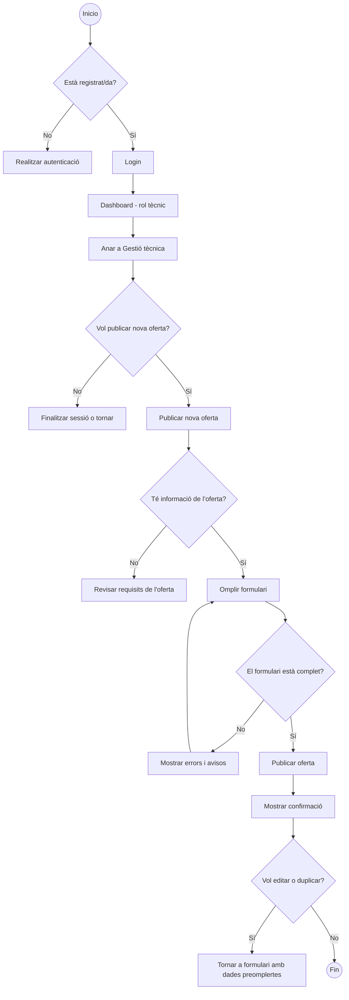
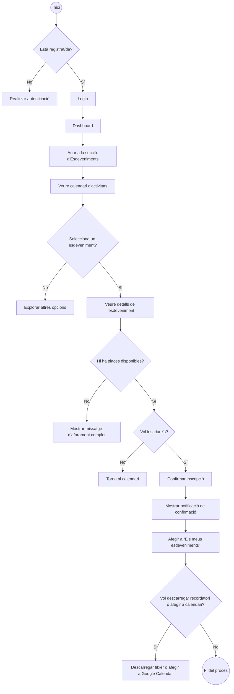
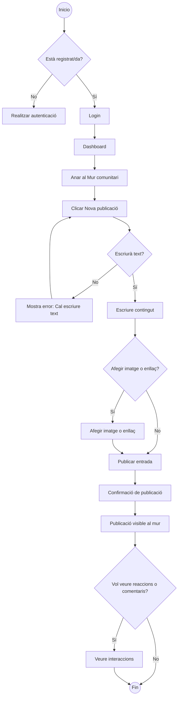
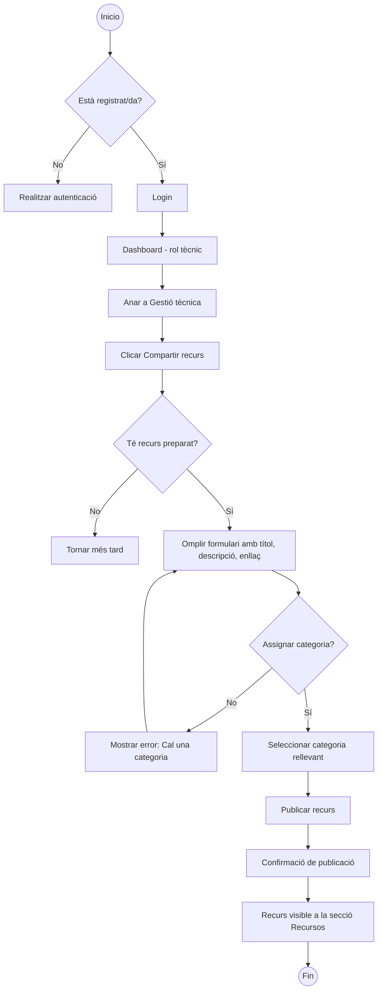
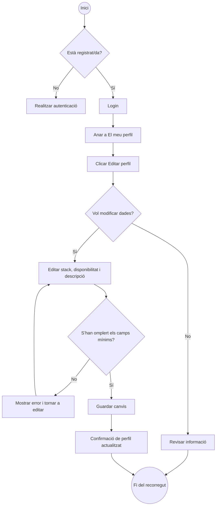

# ANÀLISI FUNCIONAL PROJECTE ITALUMNI

  

Aquesta secció defineix en detall les funcionalitats clau de la plataforma **Exalumni**, derivades de les necessitats identificades al *briefing*.  

L’objectiu de l’anàlisi funcional és transformar aquestes necessitats en requisits estructurats que guiïn el disseny i desenvolupament del producte.  

A partir de les funcions esperades, es desglossen els principals blocs funcionals (*èpiques*), es defineixen les funcionalitats associades a cadascun,  

i es formulen històries d’usuari que permeten construir una experiència centrada en els perfils reals d’ús de la plataforma.

  

## ÈPIQUES I FUNCIONALITATS PRINCIPALS

  

Les següents *èpiques* descriuen la plataforma **Exalumni**. Cada una aborda un conjunt de necessitats de l’usuari i agrupa les funcionalitats que les resoldran.  

A partir d’aquestes èpiques es derivaran històries d’usuari, els criteris d’acceptació de les quals abordarem més endavant per guiar el desenvolupament de la plataforma.

  

S'han identificat 8 èpiques:

* Èpica 1: Registre i autenticació

* Èpica 2: Gestió de perfils

* Èpica 3: Xarxa entre exalumnes

* Èpica 4: Borsa de treball

* Èpica 5: Esdeveniments i activitats

* Èpica 6: Recursos

* Èpica 7: Notificacions i comunicacions

* Èpica 8: Administració de la plataforma

  

Cadascuna té una sèrie de funcionalitats descrites a continuació:

  

---

  

### Èpica 1: Registre i autenticació

  

**Funcionalitats E1:**

- Registre d’exalumnes amb validació per correu electrònic.

- Inici de sessió amb correu electrònic i contrasenya.

- Recuperació de contrasenya.

- Rols diferenciats: exalumne/a, tècnic/a, administrador/a.

- Validació d’identitat per part de l’administrador/a.

  

---

  

### Èpica 2: Gestió de perfils

  

**Funcionalitats E2:**

- Creació i edició de perfil professional.

- Afegir tecnologies, interessos i objectius laborals.

- Visualització de perfils públics dins la xarxa.

- Filtres per *stack*, nivell o situació laboral.

  

---

  

### Èpica 3: Xarxa entre exalumnes

  

**Funcionalitats E3:**

- Cerca i exploració de membres.

- Enviament de missatges directes.

- Sol·licitud i acceptació de connexió.

- Mur comunitari per compartir experiències o recursos.

  

---

  

### Èpica 4: Borsa de treball

  

**Funcionalitats E4:**

- Visualització d’ofertes filtrades per *stack*, tipus de contracte, etc.

- Publicació d’ofertes per part de tècnics o administradors.

- Aplicació directa o redirecció a llocs externs.

- Marcar ofertes com a preferides.

  

---

  

### Èpica 5: Esdeveniments i activitats

  

**Funcionalitats E5:**

- Calendari d’esdeveniments públics o privats.

- Registre o inscripció a esdeveniments.

- Gestió d’esdeveniments per part de tècnics o administradors.

- Recordatoris automàtics.

  

---

  

### Èpica 6: Recursos

  

**Funcionalitats E6:**

- Repositori categoritzat de materials de suport.

- Pujada de recursos per part de tècnics o administradors.

- Marcatge de recursos com a favorits.

  

---

  

### Èpica 7: Notificacions i comunicacions

  

**Funcionalitats E7:**

- Notificacions automàtiques per correu o dins la plataforma.

- Personalització del tipus de notificacions.

- Comunicacions segmentades per rol, *stack* o interessos.

  

---

  

### Èpica 8: Administració de la plataforma

  

**Funcionalitats E8:**

- Gestió d’usuaris, rols i validacions.

- Gestió de continguts (ofertes, esdeveniments, recursos).

- Panell d’estadístiques d’ús i activitat.

  
  

## SITEMAP

  

La plataforma Exalumni està estructurada en diverses seccions principals, cadascuna dissenyada per oferir funcionalitats específiques tant per a les persones exalumnes com per a l’equip tècnic i les persones administradores.

El diagrama complet d’aquest sitemap es pot consultar a

[**l’annex-2-projecte-1-sitemap-italumni**](https://github.com/it-academy-front-end/sprints-refactoring/blob/main/moodle/3-projectes/projecte-1-italumni/annexos/annex-2-projecte-1-sitemap-italumni.png)

  

### 1. Landing Page

És la pàgina d'accés públic. Conté informació general com:

- Què és Exalumni.

- Qui som / IT Academy.

- Accés al sistema mitjançant **login** o **registre**.

  

### 2. Dashboard

És l’espai privat per a les persones registrades. Inclou les següents funcionalitats:

  

#### My Profile

Permet veure i editar el perfil professional, configurar preferències de privacitat i notificacions.

  

#### Comunitat

Espai per cercar exalumnes, gestionar contactes, enviar missatges i mantenir el contacte.

  

#### Borsa de treball

Permet cercar ofertes laborals, desar-ne com a favorites i fer seguiment de candidatures.

  

#### Esdeveniments

Visualització del calendari, detalls dels esdeveniments i historial de participació.

  

#### Recursos

Biblioteca categorizada on es poden cercar, desar o pujar recursos útils.

  

#### Mur / Fòrum

Espai per publicar missatges, llegir publicacions d'altres persones i reaccionar o comentar.

  

### 3. Gestió tècnica (només tècnics)

Panell exclusiu per a l’equip tècnic amb accions com:

- Publicar ofertes de treball.

- Crear esdeveniments.

- Pujar recursos.

- Crear cursos i classificar-los.

- Consultar mètriques d'activitat.

  

### 4. Administració

Secció reservada a les persones administradores, amb funcions com:

- **Gestió d’usuaris**: validar registres, editar rols o suspendre comptes.

- **Gestió de continguts**: revisar i moderar publicacions.

- **Estadístiques generals**: visualització de l’ús i activitat de la plataforma.

  

## USER JOURNEYS

Els **user journeys** descriuen els recorreguts típics que segueixen les persones usuàries per assolir objectius concrets dins de la plataforma Exalumni. Aquests recorreguts ens permeten entendre com interactuen amb les funcionalitats disponibles, identificar els punts clau de l’experiència i assegurar-nos que el disseny de la plataforma respongui a necessitats reals d’ús.

  

Cada *journey* parteix d’un objectiu concret i detalla el camí ideal —*happy path*— que l’usuari segueix des de l’inici fins a assolir-lo, incloent les funcionalitats involucrades i les interaccions principals.

  

S'han plantejat els user journeys que exemplifiquen escenaris clau de la plataforma.

  

* Journey: Connexió entre exalumnes

* Journey: Cerca d’ofertes de treball

* Journey: Publicació d’una oferta laboral

* Journey: Inscripció a un esdeveniment

* Journey: Recerca de recursos per a l’ocupabilitat

* Journey: Publicació al mur comunitari

* Journey: Compartir recurs per part d’un/a tècnic/a

* Journey: Edició del perfil per actualitzar stack i disponibilitat

  

A continuació es descriue detalladament cada user journey:

  

---

  

### Journey: Connexió entre exalumnes

  

#### **Descripció**  

Un exalumne vol establir contacte amb altres exalumnes que hagin cursat el mateix cohort o comparteixin interessos tècnics (stack, tecnologies, objectius professionals).

  

#### **Objectiu assolit**  

El/la usuari/a aconsegueix establir una connexió amb una altra persona amb interessos similars i inicia una conversa.

  

#### **Happy path**  

`Inici → Login → Dashboard → Comunitat → Buscar exalumnes → Aplicar filtres → Veure perfil → Enviar sol·licitud de connexió → Connexió acceptada → Enviar missatge`

  

#### **User flow graph**  

Copia i enganxa aquest codi al [Mermaid Live Editor](https://mermaid.live) per visualitzar el flux del recorregut:

  

```mermaid

graph TD

  A((Inicio)) --> B{¿Está registrado?}

  B -- No --> C[Realizar autenticación]

  B -- Sí --> D[Login]

  D --> E[Dashboard]

  E --> F[Ir a Comunidad]

  F --> G{Buscar exalumnos}

  G --> G1[Usar buscador]

  G --> G2[Aplicar filtros]

  G1 --> I[Listado de matches]

  G2 --> I

  I --> J[Seleccionar exalumno]

  J --> K[Mostrar perfil]

  K --> L{¿Enviar solicitud?}

  L -- No --> I

  L -- Sí --> M[Enviar solicitud]

  M --> N[Solicitud pendiente]

  N --> O{¿Solicitud aceptada?}

  O -- No --> P[Esperar aceptación]

  O -- Sí --> Q[Mostrar notificación de aceptación]

  Q --> R{¿Quieres escribir un mensaje?}

  R -- No --> S((Fin))

  R -- Sí --> T[Abrir chat y enviar mensaje]

  ```

  

---

  

### Journey: Cerca d’ofertes de treball

  

#### **Descripció**  

Un exalumne vol explorar i trobar ofertes laborals relacionades amb el seu perfil professional, aplicant filtres segons la seva experiència o stack tecnològic, per tal de postular-s’hi o guardar-les per més endavant.

  

#### **Objectiu assolit**  

El/la usuari/a identifica i guarda o es postula a una oferta rellevant per al seu perfil.

  

#### **Happy path**  

`Inici → Login → Dashboard → Borsa de treball → Aplicar filtres (stack / experiència) → Veure detall de l’oferta → Guardar o Postular-se → (opcional) Veure estat a “Les meves candidatures”`

  

#### **User flow graph**  

Copia i enganxa aquest codi al [Mermaid Live Editor](https://mermaid.live) per visualitzar el flux del recorregut:

  

```mermaid

graph TD

  A((Inicio)) --> B{Està registrat/da?}

  B -- No --> C[Autenticació]

  B -- Sí --> D[Login]

  D --> E[Dashboard]

  E --> F[Anar a Borsa de treball]

  F --> G{Aplicar filtres}

  G --> G1[Per stack]

  G --> G2[Per experiència]

  G1 --> H[Llistat d’ofertes]

  G2 --> H

  H --> I[Seleccionar oferta]

  I --> J[Veure detall de l’oferta]

  J --> K{Acció a realitzar}

  K -- Guardar --> L[Guardar oferta]

  K -- Postular-se --> M[Omplir formulari / enviar CV]

  M --> N[Confirmació de postulació]

  N --> O{Vol veure l'estat?}

  O -- No --> P((Fin))

  O -- Sí --> Q[Anar a Les meves candidatures]

  Q --> R[Veure estat de postulacions]

```

  

---

  

### Journey: Publicació d’una oferta laboral

  

#### **Descripció**  

Un/a tècnic/a vol publicar una nova oferta de feina per a la comunitat d’exalumnes, segmentada segons stack i nivell professional.

  

#### **Objectiu assolit**  

El/la tècnic/a publica una oportunitat laboral segmentada per stack i nivell.

  

#### **Happy path**  

`Inici → Login → Dashboard (rol tècnic) → Gestió tècnica → Publicar nova oferta → Omplir formulari → Publicar`

  

#### **User flow graph**  

Copia i enganxa aquest codi al [Mermaid Live Editor](https://mermaid.live) per visualitzar el flux del recorregut:

  



  

---

  

### Journey: Inscripció a un esdeveniment

  

#### **Descripció**  

Un/a exalumne vol apuntar-se a un esdeveniment de networking o formació relacionat amb el seu desenvolupament professional.

  

#### **Objectiu assolit**  

L’usuari/a s’inscriu fàcilment a una activitat i pot gestionar-la.

  

#### **Happy path**  

`Inici → Login → Dashboard → Esdeveniments → Veure calendari → Seleccionar esdeveniment → Veure detalls → Inscriure's → Confirmació → “Els meus esdeveniments”`

  

#### **User flow graph**  

Copia i enganxa aquest codi al [Mermaid Live Editor](https://mermaid.live) per visualitzar el flux del recorregut:

  



  

---

  

### Journey: Recerca de recursos per a l’ocupabilitat

  

#### **Descripció**  

Un/a exalumne vol accedir a recursos útils per millorar el seu CV, portafoli o preparar entrevistes.

  

#### **Objectiu assolit**  

L’usuari/a troba i guarda contingut que li ajuda en el seu procés d’ocupabilitat.

  

#### **Happy path**  

`Inici → Login → Dashboard → Recursos → Buscar per categoria (CV / entrevistes / portafoli) → Veure recurs → Guardar a favorits`

  

#### **User flow graph**  

```mermaid

graph TD

  A((Inicio)) --> B{Està registrat/da?}

  B -- No --> C[Realitzar autenticació]

  B -- Sí --> D[Login]

  D --> E[Dashboard]

  E --> F[Anar a la secció de Recursos]

  F --> G{Vol buscar per categoria?}

  G -- No --> H[Veure recursos destacats]

  G -- Sí --> I[Seleccionar categoria (CV, entrevista, portafoli...)]

  H --> J[Llistar recursos disponibles]

  I --> J

  J --> K{Selecciona un recurs?}

  K -- No --> L[Torna a la llista]

  K -- Sí --> M[Veure detall del recurs]

  M --> N{Vol desar als favorits?}

  N -- No --> O[Fi del recorregut]

  N -- Sí --> P[Afegir als favorits]

  P --> Q[Confirmació de desament]

  Q --> R((Fin))

  

```

  

---

  

### Journey: Publicació al mur comunitari

  

#### **Descripció**  

Un/a exalumne vol compartir una reflexió o recomanació professional al mur comunitari.

  

#### **Objectiu assolit**  

L’usuari/a contribueix activament a la comunitat i genera conversa.

  

#### **Happy path**  

`Inici → Login → Dashboard → Mur comunitari → Crear nova publicació → Escriure contingut → (Opcional: afegir imatge/enllaç) → Publicar → Veure reaccions o comentaris`

  

#### **User flow graph**  



  

---

  

### Journey: Compartir recurs per part d’un/a tècnic/a

  

#### **Descripció**  

Un/a tècnic/a vol pujar un recurs útil (guia, article, vídeo, etc.) per a tota la comunitat d’exalumnes.

  

#### **Objectiu assolit**  

El/la tècnic/a contribueix amb contingut útil per a tota la comunitat segmentada.

  

#### **Happy path**  

`Inici → Login → Dashboard (rol tècnic) → Gestió tècnica → Subir recurs → Rellenar detalls → Categoritzar i publicar → Recurs disponible a la secció Recursos`

  

#### **User flow graph**  



  

---

  

### Journey: Edició del perfil per actualitzar stack i disponibilitat

  

#### **Descripció**  

Un/a exalumne vol actualitzar la informació del seu perfil per reflectir la seva situació laboral actual i les seves habilitats tècniques.

  

#### **Objectiu assolit**  

El perfil reflecteix millor la seva situació i augmenta les seves possibilitats de connexió.

  

#### **Happy path**  

`Inici → Login → El meu perfil → Editar perfil → Modificar tecnologies, disponibilitat, descripció personal → Guardar canvis`

  

#### **User flow graph**  

